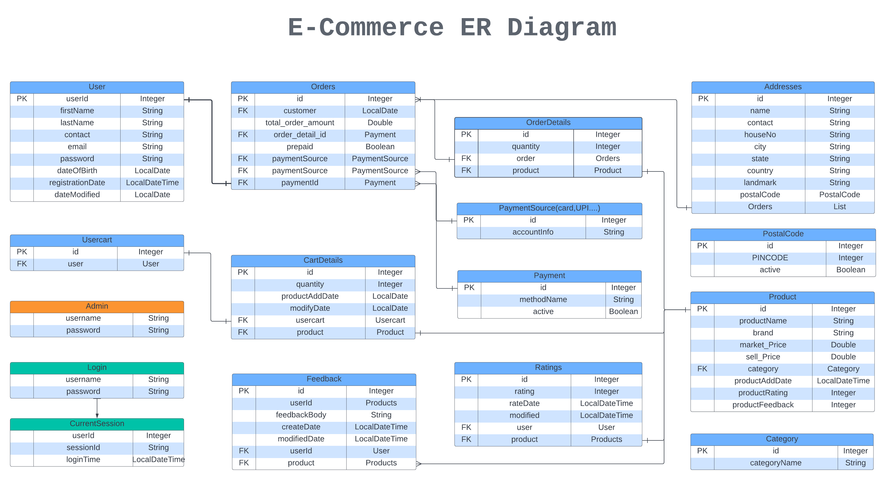
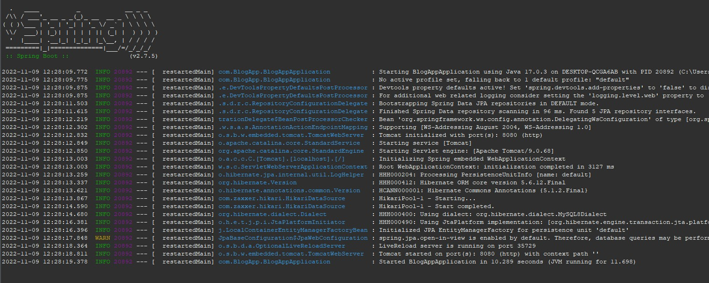
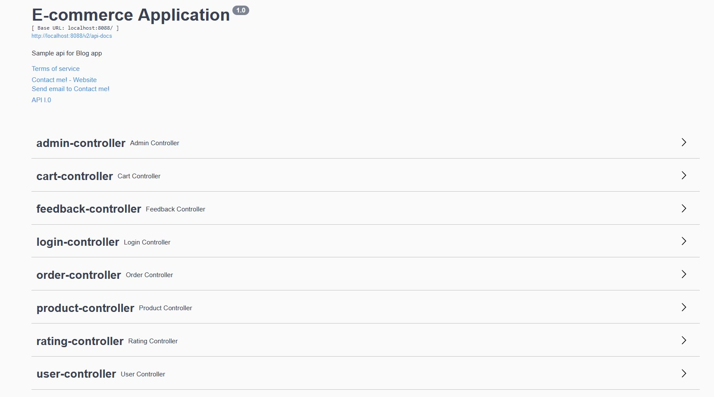

# E-Commerce-Rest-API

#### Er Diagram



#### This is a springboot project which provide Web Service (REST API). 

#
#### User can,
1. Create a User account.
2. Update your account details.
3. Login to your account.
4. Search a product by name
5. Sort product by category, price, new, rating, feedback.
6. Add a product to cart
7. Order product from cart
8. Order product directly without addinng to cart.
9. Add feedbacks.
10. Add ratings.

#### Admin can,
1. Add new Catagory.
2. Add new Product
3. Add serviceable Postal code
4. Add Payment method
5. Get sales report => By Area, User, Catagory, City, State and more.
6. Add debit/credit card and balance.

#### How to use?

As this is a rest API project, client part hasn't added to it. But you can use Swagger or Postman to play with the API. And also you can use this API with your frontend project. As it will be on localServer on your PC you need to keep the server on while playing with it. Steps given below for additional info,
#
```
1. CREATE database ecom;
```
#
Create a database on your local system. If you don't have MySQL installed, kindly install it first. 
- [Install](https://dev.mysql.com/doc/refman/8.0/en/macos-installation.html) - On Mac
- [Install](https://dev.mysql.com/doc/refman/8.0/en/windows-installation.html) - On Windows
- [Install](https://dev.mysql.com/doc/mysql-shell/8.0/en/mysql-shell-install-linux-quick.html) - On Linux
#
Once Installed please set/keep your mysql credentials as below 
#

```
username: root
password: root
```
#
and create the database as mentioned above. Database name-> blogApp;
#

```
2. git clone https://github.com/starving-array/E-Commerce-Rest-API.git;
```
#
Clone this repo to your local system and open STS to import and run the project. 
If you don,t have STS IDE on your system, kindly download [STS](https://spring.io/tools).
#

```
3. Open STS and Import the Project;
```
#
File -> Open Projects from File Systems -> Directory
- Browse to the location where you have cloned this project. And select  _blog-api_ 
#
Next-> Finish. _It might take a few minutes to download all the dependencies on your local system. You can check the progress bar at righ-down corner._  
#
Once finished update the Maven project to make sure all the dependencies have downloaded.
#
Right Click on _blog_api_ at package exporer on leftside window, 
Maven -> Update Project -> check Force Update on SnapShots/releases -> Ok
#

 _Congratulation, you've successfully imported the project on your system_

#

```
4. Start the Spring Boot App Server;
``` 

#
Right Click on _blog_api_ at package exporer on leftside window, 
Run as -> Spring Boot App
#

_You can see the process as a console window will be opening below._

#



```
5. http://localhost:8088/swagger-ui/;
``` 
#

Open this [link](http://localhost:8088/swagger-ui/) on broswer. It will open the Swagger UI. You can play with All the API there. 

#


#
```
6. STOP the server;
```

#
Once you are done with playing, click on the red square box on top of the console to stop the server.
#

#### Important Facts,
1. _The port for this application has set 8080. You can change it from Application Properties in resource folder, or stop any other running app before starting this as it can create conflict for same port that you might be using coincedently._

#
```
#changing the server port
server.port=8088
```
#

2. _Incase if have different root name and password for mysql in your system, you change this application username and password from Application Properties.

#
```
# MySql username and Password
spring.datasource.username=root
spring.datasource.password=root
```

#
### API names and Use=> ###

#
```sh
**UUID used as security param to authenticate user and maintain security.
```
#

#### 1. User-controller:
- createAccountH :  _Create a new account._
- updateAccountH : _Modify your account_

#
##### 1.1 Login-controller: 

- logInUser : _Login with Contact No and Password. This will genarate a UUID to control activity and it will also maintain security._
- logoutUser : _Session will be deleted, (UUID) once you have logged out._
- getAccountDetails : _With UUID and account id as parameters, it will match if the user is same and return user detail._
- logInAdmin : _Login with admin login and Password. This will genarate a UUID to control admin activity in Admin controller and it will also maintain security._

##### Admin credential:
#
```
mobileNo=0000000000;
password=1234567890;
```
 ** For now this is the default credential of admin.
#
#### 2. Rating-controller:
- addRating : _User can add rating to products._
#### 3. Feedback-controller:
- addFeedback : _User can add feedbacks to products._
- modifyFeedback : _User can modify feedbacks._
- viewMyFeedback : _User can get all feedback made by them._
- viewAllFeedback : _User can get all feedback of the product._
- deleteFeedback : _User can delete own feedback of the product._

#
#### 3.Product-Controller:
- getProductById : _Get a product by Product Id._ 
- getProductsByName : _Search products by name._

###### Product by sort:
- categorySortByDateAsc : _A category sorted by date asc._
- categorySortByDateDesc : _A category sorted by date desc._
- sortByDateDesc : _Sorted by date desc._
- sortByDateAsc : _Sorted by date asc._
- categorySortByNameDesc : _A category sorted by name desc._
- categorySortByNameAsc : _A category sorted by name asc._
- sortByPriceDesc : _Sorted by price desc._
- sortByPriceAsc : _Sorted by price asc._
- categorySortByPriceDesc : _A category sorted by price desc._
- categorySortByPriceAsc : _A category sorted by price asc._
- sortByMaxMinPriceDesc : _Sorted by max-min price desc._
- sortByMaxMinPriceAsc : _Sorted by max-min price asc._
- CategorySortByMaxMinPriceDesc : _A category sorted by max-min price desc._
- CategorySortByMaxMinPriceAsc : _A category sorted by max-min price asc._
- sortByMinPriceDesc : _Sorted by min price desc._
- sortByMinPriceAsc : _Sorted by min price asc_
- CategorySortByMinPriceDesc : _A category sorted by min price desc._
- CategorySortByMinPriceAsc : _A category sorted by min price desc._
- sortByMaxPriceDesc : _Sorted by max price desc._
- sortByMaxPriceAsc : _Sorted by max price asc._
- CategorySortByMaxPriceDesc : _A category sorted by max price desc._
- CategorySortByMaxPriceAsc : _A category sorted by max price desc._
- sortByFeedbackDesc : _Sorted by feedback desc._
- sortByFeedbackAsc : _Sorted by feedback asc._
- sortByRatingDesc : _Sorted by rating desc._
- sortByRatingAsc : _Sorted by rating asc._
#

#### 4. Cart-Controller:
- addToCart : _Add a product to cart._ 
- viewCart : _View user cart._
- modifyCart : _Modify a product in cart._
- deleteFromCart : _Delete a product from cart._
#

#### 5.Order-Controller:
- placeDirectOrder : _Place an order with card credentials and shipping address from product page._ 
- placeCartOrder : _Place order with seleted products from cart._
- placeCartOrderAll : _Place order of all the products in cart._
- viewOrderDetailById : _View order detail by order id._
- viewOrders : _View all order details in List._
```
1. For now the order can be placed with card only. 
2. sessionId need to pass with user id to authenticate. I have skipped spring security and implemented manual mode to genarate UUID.
```
#
#### 6. Admin-Controller:
** Use the above admin credential and login first to genarate UUID/SessionId for admin. This UUID will be needed to use the service in admin controller. 
- getAllUser : _Get list of all users registered in the database._ 
- addNewCard : _Add new dummy card credential with balance. CardNo, CardPin, Balance._
- addBalance : _Add balance to a registered card._
- registerCatagory : _Register a new category. Note the category id and use it while registering a new product._
- getAllCategory : _Get a list of all registered category._
- registerProduct : _Registed a new product with a category id._
- addPostalCodes : _Add a new postal code or list of postal codes. While filling the shipping address and pin code the system will check if pin code is registered to give service or else it will not be deliverable._
- deactivePostalCodes : _Deactivate a postal code or postal codes to prevent placing order to that area._
- reactivePostalCodes : _Reactivate a postal code or postal codes to all user to order to that area._
- addPaymentMethod: _Add supported paymethods, i.e card, upi, cash, etc._
- deactivatePaymentMethod : _Deactivate a payment method to prevent user to pay for a order using that method._
- reactivatePaymentMethod : _Reactive a payment method._
##### Admin report:
- viewOrderByCardNo : _Get list of orders paid by a card by card no._
- viewOrderByPostalCode : _Get list of orders delivered to a postal code by postal code._
- viewOrderByCity : _Get list of orders delivered to a city by city name._
- viewOrderByState : _Get list of orders delivered to a state by state name._ 
- viewOrderByState : _Get list of orders ordered by a customer by user id._


#
```
There are still scope of so many more API based on business logic and demand. Hope you have fun playing and liked it. 
```
#### Thank you...  
